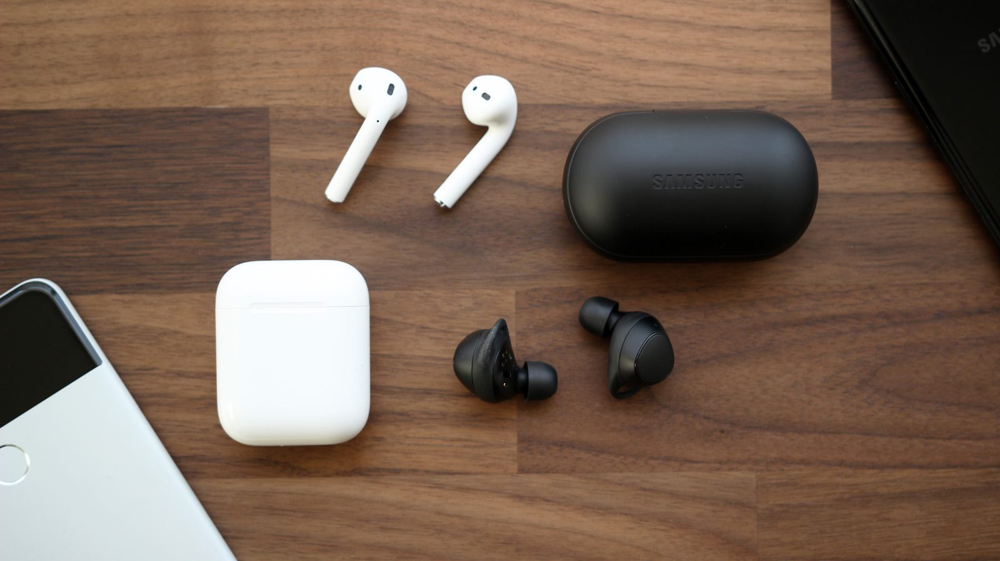

**[English](/README_EN.md) | 中文**

	
	 
	 
	

		<a href="https://www.patreon.com/sindresorhus">My open source work is supported by the community</a>
	

	

		Special thanks to:
		 
		
	

	 
	 

<!--

	<b>✨ Prelaunching the <a href="https://awesomeweekly.co">Awesome Weekly</a> newsletter! ✨</b>
	<b> Vote it up on <a href="https://www.producthunt.com/posts/awesome-weekly">Product Hunt</a></b>

 
-->

	<a href="awesome.md">为什么要写这个清单?</a>&nbsp;&nbsp;&nbsp;
	<a href="contributing.md">Contribution guide</a>&nbsp;&nbsp;&nbsp;
	<a href="create-list.md">Creating a list</a>&nbsp;&nbsp;&nbsp;
	<a href="https://twitter.com/awesome__re">Twitter</a>&nbsp;&nbsp;&nbsp;
	<a href="https://www.redbubble.com/people/sindresorhus/works/30364188-awesome-logo">Stickers & t-shirts</a>

 

	Just type <a href="https://awesome.re"><code>awesome.re</code></a> to go here. Check out my <a href="https://blog.sindresorhus.com">blog</a> and follow me on <a href="https://twitter.com/sindresorhus">Twitter</a>.

 

## 程序员必备清单

- [耳机](#耳机)
- [鼠标](#鼠标)
- [键盘](#键盘)
- [背包](#背包)
- [相机](#相机)
- [水杯](#水杯)
- [硬盘](#硬盘)
- [钱包](#钱包)
- [播放器](#播放器)
- [笔记本](#笔记本)
- [手表](#手表)

## 耳机
- [第1名] [Apple Airpods](https://union-click.jd.com/jdc?d=VwMEDs) - Mobile operating system for Apple phones and tablets.

		
    购买链接：[京东](https://union-click.jd.com/jdc?d=VwMEDs)，[淘宝](https://www.amazon.cn/gp/product/B074JWSF99)，[亚马逊](http://product.dangdang.com/25138676.html)

<table>
  <tbody>
    <tr>
      <td align="center" valign="middle">
        
      </td>
      <td align="center" valign="middle">
        
      </td>
    </tr>
    <tr>
      <td align="center" valign="middle">
        
      </td>
      <td align="center" valign="middle">
        
      </td>
    </tr>
  </tbody>
</table>

- [Bragi Dash](https://github.com/iCHAIT/awesome-macOS) - 耳机介绍

购买链接：[京东](https://item.jd.com/12152559.html)，[淘宝](https://www.amazon.cn/gp/product/B074JWSF99)，[亚马逊](http://product.dangdang.com/25138676.html)

<table>
<tbody>
<tr>
	<td align="center" valign="middle">
		
	</td>
	<td align="center" valign="middle">
		
	</td>
</tr>
<tr>
	<td align="center" valign="middle">
		
	</td>
	<td align="center" valign="middle">
		
	</td>
</tr>
</tbody>
</table>

- [Samsung Gear IconX](https://github.com/herrbischoff/awesome-macos-command-line)

购买链接：[京东](https://item.jd.com/12152559.html)，[淘宝](https://www.amazon.cn/gp/product/B074JWSF99)，[亚马逊](http://product.dangdang.com/25138676.html)

<table>
<tbody>
<tr>
  <td align="center" valign="middle">
    
  </td>
  <td align="center" valign="middle">
    
  </td>
</tr>
<tr>
  <td align="center" valign="middle">
    
  </td>
  <td align="center" valign="middle">
    
  </td>
</tr>
</tbody>
</table>

- [Bose QuietComfort 35](https://github.com/agarrharr/awesome-macos-screensavers)
- [Sony WH-1000XM2](https://github.com/iCHAIT/awesome-macOS) - 耳机介绍
- [Sennheiser PXC 550](https://github.com/vsouza/awesome-ios) - Mobile operating system for Apple phones and tablets.

## 鼠标
## 键盘
## 背包
## 相机
## 水杯
## 硬盘
## 钱包
## 播放器
## 笔记本
## 手表

## 支持我

如果你觉得我写的东西对你有用，不妨请我喝杯咖啡，感谢支持！

